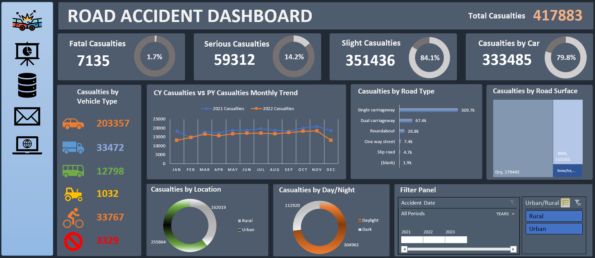

# 🚧 Road Accident Analysis in Excel

This project presents a detailed analysis of road accident data using **Microsoft Excel**. The objective is to extract meaningful insights that can help reduce accidents and improve traffic safety through data-driven decisions.

---

## 📂 Project Files

- 📊 `Road Accident Dashboard.xlsx` – Main Excel file with interactive analysis and dashboards
- 🗃️ `Road Accident Dashbaord_Dataset.xlsx.xlsb` – Raw dataset used for analysis
- 🖼️ `Road-Accident-Dashboard-img.png` – Preview image of the Excel dashboard

---

## 🧠 Objectives

- Analyze accident trends over time
- Identify peak accident times and dangerous zones
- Classify accidents by severity, vehicle type, and weather conditions
- Create a clean, interactive dashboard in Excel

---

## 📸 Dashboard Preview

  

---

## 📊 Dashboard Features

- Accidents by Time of Day, Day of Week, and Month
- Vehicle Type and Road User Involvement
- Weather & Lighting Conditions Impact
- Severity Classification & Frequency
- Dynamic filters using Slicers and Pivot Tables

---

## 🛠 Tools Used

| Tool                   | Purpose                         |
|------------------------|---------------------------------|
| Microsoft Excel        | Data analysis and dashboard     |
| Pivot Tables           | Summarize accident patterns     |
| Pivot Charts           | Trend visualization             |
| Slicers                | Interactive filtering           |
| Conditional Formatting | Pattern highlighting            |

---

## 🔍 Key Takeaways

- Evening rush hours and weekends show the highest accident spikes
- Two-wheelers and pedestrians are most affected
- Poor visibility and rainy weather increase accident severity
- A few intersections account for a majority of accidents

---

## 🙋‍♂️ Author

**Bhushan Kumbhar**  
📧 [kumbharbhushan27@gmail.com](mailto:kumbharbhushan27@gmail.com)  
🔗 [LinkedIn](https://www.linkedin.com/in/bhushan-kumbhar01/)  
🐙 [GitHub](https://github.com/bhushan-dataanalyst)

---

## ⭐ Like this project?

If you found this project useful, please ⭐ star the repo and feel free to connect with me!

